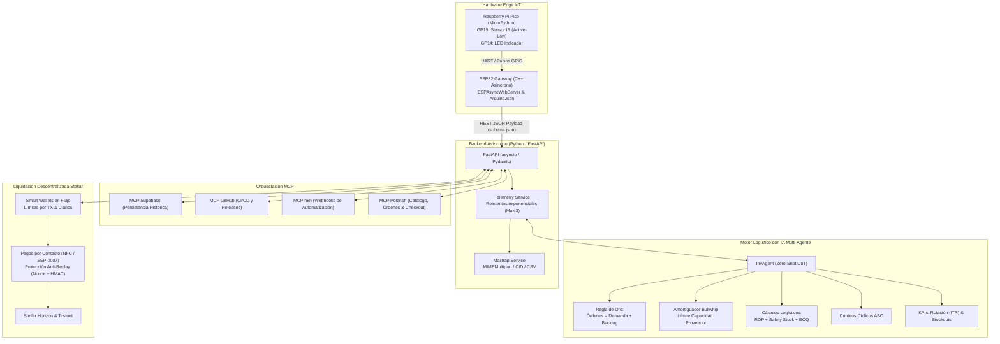

# 📦 Sistema Autónomo de Gestión Logística e Inventario IoT con IA Multi-Agente

Sistema integral de ingeniería logística para la supervisión de flujo de materiales, captura de telemetría física en tiempo real en el Edge (**Raspberry Pi Pico** y **ESP32**), motor de inferencia y toma de decisiones **InvAgent (Chain-of-Thought)** para mitigación del Efecto Látigo (*Bullwhip Effect*), servicio de alertas enriquecidas vía **Mailtrap**, y orquestación contextual mediante servidores **MCP** (*Model Context Protocol*).

---

## 🏛️ Arquitectura del Sistema



---

## 🔌 1. Hardware Edge & Conexiones Físicas

### A. Raspberry Pi Pico (MicroPython)
- **GP15**: Entrada digital conectada al **Sensor Infrarrojo (IR)** óptico con resistencia interna *Pull-Up*.
  - `0`: Objeto detectado (activo-bajo).
  - `1`: Ausencia de objeto / canal despejado.
- **GP14**: Salida digital a **LED de estado**. Se enciende inmediatamente ante la detección y se apaga al liberar el paso.
- **GP25**: LED *Heartbeat* (parpadeo cada 2 segundos).
- **Firmware**: Ubicado en [`hardware/pico/main.py`](file:///hardware/pico/main.py).

### B. ESP32 Gateway (C++ Asíncrono)
- **Arquitectura**: Desarrollado con programación asíncrona no bloqueante usando `ESPAsyncWebServer` y `ArduinoJson`.
- **Estructura modular**:
  - [`hardware/esp32/main.ino`](file:///hardware/esp32/main.ino): Gestión de ciclo de vida y FreeRTOS tasks.
  - [`hardware/esp32/Server.hpp`](file:///hardware/esp32/Server.hpp): Inicialización y enrutamiento del servidor web asíncrono.
  - [`hardware/esp32/API.hpp`](file:///hardware/esp32/API.hpp): Endpoints `GET`, `POST`, `PUT`, `DELETE` y `GET /status`.
  - [`hardware/esp32/ESP32_Utils_APIREST.hpp`](file:///hardware/esp32/ESP32_Utils_APIREST.hpp): Serialización y deserialización estricta.

---

## 📜 2. Contrato de Datos Centralizado (`schema.json`)

Toda la comunicación entre el hardware, el backend y los agentes está gobernada por el esquema estándar Draft-07 en [`schema.json`](file:///schema.json):

```json
{
  "device_id": "ESP32-GATEWAY-ZONE-A",
  "timestamp": "2026-09-25T12:00:00Z",
  "sensor_data": {
    "ir_status": 0,
    "item_count": 42,
    "sampling_rate_ms": 100
  },
  "inventory_state": {
    "current_stock": 18,
    "backlog": 12,
    "reorder_point": 30,
    "expected_demand": 25,
    "lead_time_days": 3,
    "safety_stock": 10
  }
}
```

---

## 🧠 3. Motor Logístico InvAgent & Toma de Decisiones

El agente logístico **InvAgent** toma decisiones de reabastecimiento en modo zero-shot aplicando una secuencia formal de dos pasos:

1. **Razonamiento Chain-of-Thought (CoT)** en exactamente 1-2 oraciones previas a la acción:
   - *Oración 1 (Diagnóstico)*: Identifica la brecha de stock respecto al punto de reorden y el backlog acumulado.
   - *Oración 2 (Prescripción)*: Aplica la Regla de Oro y dimensiona el lote óptimo considerando la capacidad del proveedor.
2. **Aplicación de la Regla de Oro**:
   $$\text{Órdenes Abiertas} = \text{Demanda Esperada} + \text{Backlog}$$
3. **Mitigación del Efecto Látigo (Bullwhip Effect)**:
   El pedido neto se calcula considerando el inventario objetivo y se acota mediante un umbral de capacidad máxima de producción ($\text{MAX\_PRODUCTION\_CAPACITY}$) para evitar oscilaciones artificiales aguas arriba en la cadena de suministros.

---

## 📧 4. Servicio de Notificaciones Enriquecidas (Mailtrap)

Cuando el stock cae al punto de reorden (`current_stock <= reorder_point`), el servicio despacha un correo enriquecido con:
- **Estructura MIME**: `multipart/related` con subpartes `alternative` (texto plano y HTML).
- **Imagen Incrustada via Content-ID (CID)**: `` garantiza renderizado nativo sin depender de peticiones HTTP externas bloqueadas por clientes de correo.
- **Adjunto de Auditoría**: Archivo CSV adjunto con el detalle completo de la lectura y el razonamiento CoT de InvAgent.

---

## ⚙️ 5. Configuración y Despliegue Local

### Opción A: Ejecución con Entorno Virtual Python

1. **Clonar el repositorio**:
   ```bash
   git clone https://github.com/tu-organizacion/sistema-logistico-iot.git
   cd sistema-logistico-iot
   ```

2. **Crear y activar entorno virtual**:
   ```bash
   python -m venv venv
   # En Windows:
   .\venv\Scripts\activate
   # En Linux/Mac:
   source venv/bin/activate
   ```

3. **Instalar dependencias**:
   ```bash
   pip install -r requirements.txt
   ```

4. **Configurar variables de entorno**:
   Copiar `.env.example` a `.env` y completar los valores:
   ```bash
   cp .env.example .env
   ```

5. **Iniciar el servidor backend**:
   ```bash
   uvicorn backend.app.main:app --host 0.0.0.0 --port 8000 --reload
   ```
   La documentación interactiva Swagger estará disponible en: `http://localhost:8000/docs`.

### Opción B: Ejecución con Docker Compose

```bash
docker-compose up --build -d
```

---

## 🧪 6. Ejecución de Pruebas Automatizadas

La suite de pruebas valida exhaustivamente el contrato JSON, las fórmulas matemáticas de inventario, la resiliencia de reintentos y la construcción MIME:

```bash
# Ejecutar pytest con reporte detallado
pytest -v tests/
```

---

## 🌐 7. Servidores MCP (Model Context Protocol)

El archivo [`mcp/mcp_config.json`](file:///mcp/mcp_config.json) incluye los adaptadores para:
- **Supabase MCP**: Conexión a la base de datos PostgreSQL para almacenar el histórico de eventos de sensores y órdenes de reposición.
- **GitHub MCP**: Operaciones automatizadas de versionado, control de ramas y tags de release.
- **n8n MCP**: Automatización de webhooks y triggers para conectar con ERPs como SAP o Odoo.
- **Polar.sh MCP**: Conexión con la plataforma Polar.sh (`https://mcp.polar.sh/mcp/polar-mcp` o sandbox) para consultar productos, gestionar pedidos de reabastecimiento y generar enlaces de checkout automáticos.

### Endpoints REST de Polar.sh en el Backend:
- `GET /api/v1/polar/status`: Estado y salud de la conexión con la API de Polar.sh.
- `GET /api/v1/polar/products`: Consulta del catálogo de productos y precios registrados.
- `GET /api/v1/polar/orders`: Historial de órdenes de compra recibidas.
- `POST /api/v1/polar/checkout`: Creación de enlaces de checkout dinámicos para reposición de materiales o dispositivos.
- `POST /api/v1/polar/webhook`: Recepción asíncrona de eventos de Polar (`order.created`, etc.).

---

## 💳 8. Stellar Smart Wallets en Flujo & Pagos por Contacto (NFC / SEP-0007)

El sistema incorpora integración con **Stellar Network** para dotar a los nodos Edge (ESP32/Pico) y terminales logísticos de capacidades de billeteras inteligentes programables (*Smart Wallets*) y pagos instantáneos por proximidad:

### A. Smart Wallets en Flujo
- **Aprovisionamiento Autónomo**: Generación de pares de claves criptográficas Ed25519 para cada dispositivo o almacén.
- **Fondeo Automático**: Integración con Friendbot en Testnet para activación inmediata con 10,000 XLM de prueba.
- **Políticas de Seguridad en el Edge**:
  - `spending_limit_per_tx`: Límite máximo de gasto por transacción para mitigar riesgos en dispositivos no supervisados.
  - `daily_limit` & `daily_spent`: Techo máximo de gasto acumulado en 24 horas.

### B. Función de Pago por Contacto (NFC / SEP-0007)
- **Estándar Universal SEP-0007**: Genera URIs estándar `web+stellar:pay?destination=...&amount=...&memo=...` compatibles con monederos móviles y terminales POS.
- **Registro NFC NDEF**: Cadena optimizada para chips NFC (PN532/RC522) con payload: `stellar:pay;dest=...;amt=...;nonce=...;sig=...`.
- **Protección Criptográfica Anti-Replay**: Cada token contactless incluye un **nonce efímero de un solo uso** y una firma HMAC-SHA256. Intentos duplicados de cobro con el mismo nonce son bloqueados inmediatamente.
- **Liquidación por Entrega de Lote**: Cuando el sensor IR detecta el conteo de recepción de material, el Smart Wallet ejecuta automáticamente la liquidación on-chain al proveedor.

### Endpoints REST de Stellar en el Backend:
- `POST /api/v1/stellar/wallets`: Aprovisiona un Smart Wallet con límites configurados.
- `GET /api/v1/stellar/wallets`: Lista las Smart Wallets gestionadas.
- `GET /api/v1/stellar/wallets/{wallet_id}`: Consulta saldo actualizado en Stellar Horizon.
- `POST /api/v1/stellar/contactless/payload`: Genera payload contactless (URI SEP-0007 + NFC NDEF) con nonce y HMAC.
- `POST /api/v1/stellar/contactless/tap`: Procesa el contacto físico (NFC Tap), valida anti-replay y firma la transacción on-chain.
- `POST /api/v1/stellar/delivery-payment`: Flujo autónomo de pago al confirmar recepción física de material en el Edge.

---

## 🚀 9. Guía de Despliegue en la Nube

### A. Despliegue en GitHub (CI/CD con GitHub Actions)

Crea el archivo `.github/workflows/ci-cd.yml`:
```yaml
name: CI/CD Pipeline

on:
  push:
    branches: [ main ]
  pull_request:
    branches: [ main ]

jobs:
  test:
    runs-on: ubuntu-latest
    steps:
      - uses: actions/checkout@v4
      - name: Set up Python
        uses: actions/setup-python@v5
        with:
          python-version: '3.11'
      - name: Install dependencies
        run: |
          pip install -r requirements.txt
      - name: Run Pytest
        run: |
          pytest -v tests/
```

### B. Despliegue en Vercel (FastAPI Serverless)

1. Crear el archivo `vercel.json` en la raíz del proyecto:
   ```json
   {
     "builds": [
       {
         "src": "backend/app/main.py",
         "use": "@vercel/python"
       }
     ],
     "routes": [
       {
         "src": "/(.*)",
         "dest": "backend/app/main.py"
       }
     ]
   }
   ```
2. Desplegar mediante la CLI de Vercel:
   ```bash
   vercel --prod
   ```
3. Configurar en el panel de Vercel las variables de entorno (`MAILTRAP_API_KEY`, `ESP32_IP`, `ALERT_RECIPIENT_EMAIL`).

---

## 🛡️ Licencia y Gobernanza
Desarrollado conforme a las directivas de seguridad, cero credenciales hardcodeadas y observabilidad estructurada de Google Antigravity.
